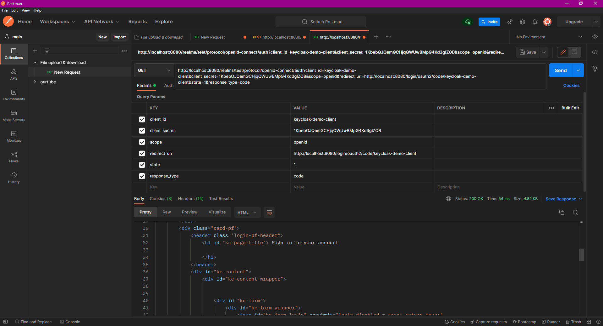

1.
http://localhost:8080/realms/test/protocol/openid-connect/auth?client_id= &client_secret= &scope= &redirect_uri= &state= &response_type=code

2.
параметр code в урле

3.
http://localhost:8080/realms/test/protocol/openid-connect/token
в теле тот самый code

4.
из json access_token иденфицирует юзера с ролем USER

5.
который получает форбидден на эндпоинт для ADMIN

но имеет доступ к остальным
